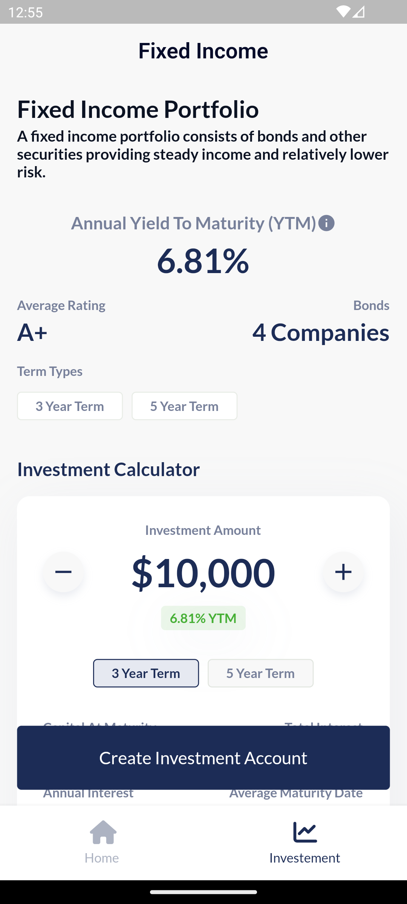
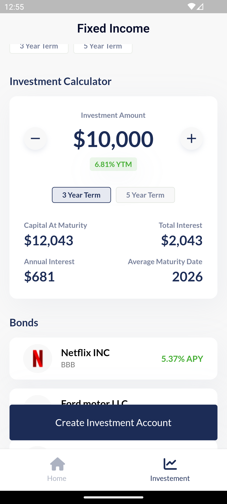
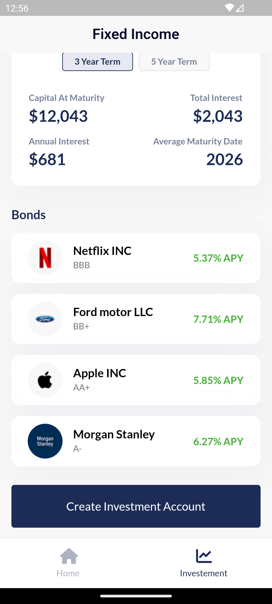
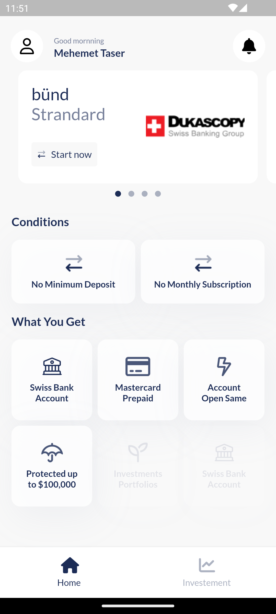

# Flutter Investment Analytics and Banking

Recreate an interactive investment page in Flutter, following the provided screenshot and recreate an interactive banking Home Screen in Flutter, based on the provided screenshot, focusing on smooth user experience and dynamic content updates.

## Features:
- Interactive investment calculator.
- Real-time bond information updates.
- Clean and modular code following Flutter best practices.
- State management using Bloc.
- Responsive design for various device sizes.
- Snap scrolling for seamless navigation through different sections.
- Dynamic card updates with a brief, semi-transparent overlay.

## Challenges and Solutions:
### Exponential Incrementation Logic:

- Challenge: Implementing exponential incrementation based on long presses.
- Solution: Utilized Flutter's GestureDetector and Timer for precise control over incrementation duration.
### Data Handling and Mock Service:

- Challenge: Simulating API calls with a mock data service.
- Solution: Implemented a mock service with asynchronous methods and Future.delayed to mimic network delays.
### Responsive Design:

- Challenge: Ensuring responsiveness on different devices.
- Solution: Employed responsive design principles, including flexible layouts and media queries.

### Investment Calculator:
- The investment calculator allows users to dynamically adjust investment parameters and see real-time updates. Exponential incrementation provides a smooth user experience during long presses on the increment/decrement buttons.

## Contribution:
- Contributions are welcome! Feel free to open issues, submit pull requests, or suggest improvements.

## Screenshots:
- Investment Scren.

  
  
  

- Home Scren.

  

